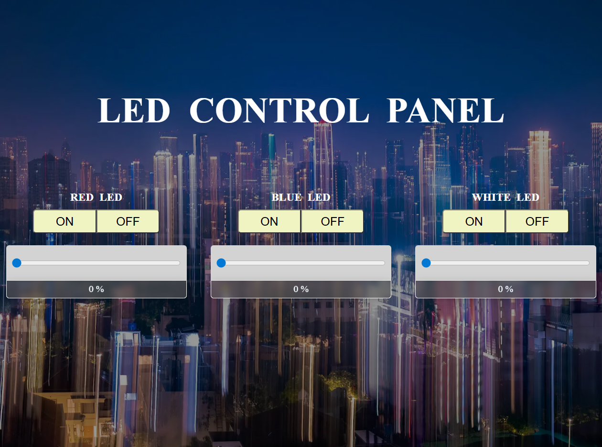

# ESP32 IoT Control System

A web-based IoT control system built on ESP32 that allows real-time control of LED states and brightness through a browser interface.

---

## 📸 Preview

---

## 🎬 Demo

▶️ Watch the system in action:

👉 https://youtu.be/8Q7R_TUvaRw

---

## 📂 Source Code

### 🔧 Firmware

👉 [View Main Code](./firmware/main.ino)

---

### 🌐 Frontend Files

- 📄 [index.html](./data/index.html)  
- 🎨 [style.css](./data/style.css)  
- ⚡ [script.js](./data/script.js)
---

## ⚙️ System Overview

This project combines embedded programming, networking, and a web-based user interface into a fully self-contained IoT system.

### 🔌 Key Features

- ESP32 Web Server with REST API (`/on`, `/off`, `/brightness`)
- SPIFFS file system for hosting frontend files
- Automatic file serving with correct MIME types
- WiFiManager with Captive Portal for easy WiFi setup
- mDNS support (`http://controlLED.local`)

### 💡 Hardware Control

- Control 3 LEDs via GPIO (26, 25, 33)
- PWM brightness control using ESP32 LEDC
- Real-time LED state management

### 🌐 System Capabilities

- Fully self-hosted web interface on ESP32
- Real-time interaction between UI and hardware
- No external server required

---

## 🛠️ Technologies Used

- ESP32 (Arduino Framework)
- HTML, CSS, JavaScript
- WebServer library
- WiFiManager (Captive Portal)
- mDNS
- SPIFFS
- PWM (LEDC)

---

## 🔌 API Endpoints

- `/on?led=1` → Turn ON LED  
- `/off?led=1` → Turn OFF LED  
- `/brightness?led=1&value=50` → Set brightness (0–100)

---

## 📁 Project Structure

firmware/ → ESP32 source code  
data/ → Web files (HTML, CSS, JS, images)  
docs/ → Demo and assets  

---

## ⚙️ Setup Instructions

1. Upload firmware to ESP32  
2. Upload SPIFFS data (HTML/CSS/JS files)  
3. Connect to WiFi using Captive Portal  
4. Access via IP address or `.local` domain  

---

## 📌 Future Improvements

- OTA (Over-the-Air) updates  
- Cloud integration (MQTT / Firebase)  
- Authentication system  
- Mobile app interface  

---

## 👨‍💻 Author

Developed as an IoT project using ESP32 and web technologies.
